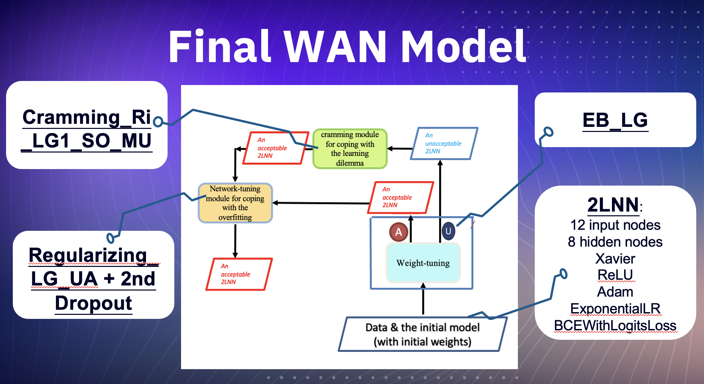

# Heart Failure Prediction Model

## Overview

This repository contains a **heart failure prediction model** developed using a **2-layer neural network (2LNN)**. The model is designed to predict heart failure events based on clinical data, leveraging techniques such as **weight tuning**, **cramming**, and **network tuning**. The dataset used consists of 12 features and 299 records related to patients with heart failure conditions.

---

## Features

1. **2LNN Architecture**:
   - The model uses a 2-layer neural network (2LNN) with **12 input nodes**, **8 hidden nodes**, and **1 output node**.
   - Xavier initialization and ReLU activation are used to improve performance.

2. **Weight Tuning**:
   - The model performs weight tuning using the **Adam optimizer** and **ExponentialLR** scheduler.
   - It uses a **BCEWithLogitsLoss** function for binary classification (death event prediction: 1 or 0).

3. **Cramming**:
   - If the model's performance is unacceptable after weight tuning, it proceeds with a cramming mechanism that adjusts the model to make it acceptable by addressing multiple unacceptable cases.

4. **Network Tuning**:
   - After weight tuning, the model undergoes **network tuning** using techniques such as **L2 Regularization** and **dropout** to enhance the model's robustness and accuracy.

---

## Dataset

The model is trained and evaluated using clinical data from heart failure patients:

- **Total records**: 299
- **Features**: 12 (5 categorical and 7 numerical)
  
### Key Features:
- **Age**
- **Anemia**
- **Creatinine Phosphokinase**
- **Diabetes**
- **Ejection Fraction**
- **High Blood Pressure**
- **Platelets**
- **Serum Creatinine**
- **Serum Sodium**
- **Gender**
- **Smoking**
- **Observation Time**

### Target:
- **Death Event (1 or 0)**

The dataset is split into **training (239 records)** and **testing (60 records)** with an 80:20 ratio.

---

## Model Architecture

### 2LNN Model

- **Input Layer**: 12 features as input nodes.
- **Hidden Layer**: 8 nodes with Xavier initialization and ReLU activation.
- **Output Layer**: 1 node for binary classification (death event prediction).
  
### Loss Function:
- **BCEWithLogitsLoss** (Binary Cross Entropy with Logits).

### Optimizer:
- **Adam** optimizer with a learning rate of 0.01.

### Learning Rate Scheduler:
- **ExponentialLR** with a decay factor of 0.95.

---

## Tuning Process

1. **Weight Tuning**:
   - Initially, the model performs weight tuning, adjusting weights using the Adam optimizer and monitoring performance based on an error criterion of **0.3**.
   - The model undergoes **50 epochs** of training.

2. **Network Tuning**:
   - If the model performs adequately after weight tuning, **network tuning** is applied.
   - Techniques such as **L2 Regularization** (with an error criterion of **0.3** and L2 penalty coefficient of 0.01) and **dropout** are used to prune irrelevant nodes and improve accuracy.

3. **Cramming**:
   - If the model does not meet performance expectations after weight tuning, cramming is applied to address unacceptable cases, improving accuracy.

---

## Results

- The model achieved improved accuracy and AUC after tuning, with the following key components contributing to its success:
  - **EB_LG Model** for initial weight tuning.
  - **Regularizing_LG_UA** and **2nd Dropout** for network tuning.
  - **Cramming_Ri_LG1_SO_MU** to handle multiple unacceptable cases and further enhance performance.
    

---

## Conclusion

This **2LNN WAN model** effectively addresses the challenge of predicting heart failure events by using a comprehensive tuning process. The use of cramming ensures that the model can handle multiple unacceptable cases, while network tuning techniques such as L2 Regularization and dropout help to further improve accuracy.

---

## Installation and Usage

To run this project, clone the repository and ensure you have the required dependencies installed:
